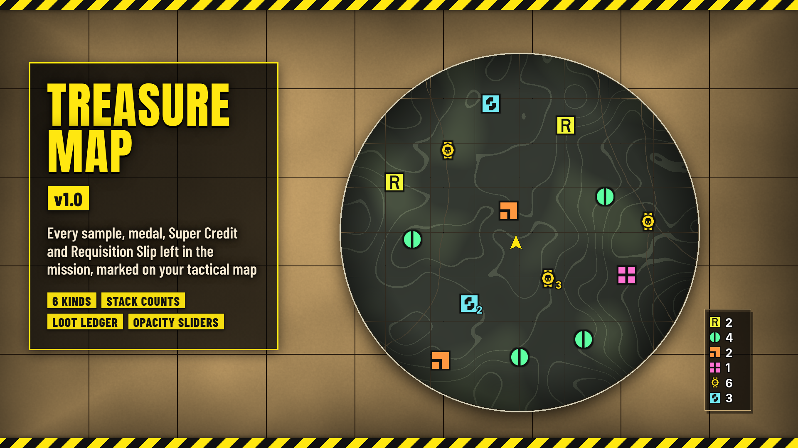

# Treasure Map

*Every sample, medal, Super Credit and Requisition Slip left in the mission, marked on your tactical map.*

**Download:** `Treasure-Map-1.0.1.zip` from the [latest release](https://github.com/Th3chef/Treasure-Map/releases/latest) (not the source code). Needs [Bingus Shared Loader](https://www.nexusmods.com/helldivers2/mods/16292) v19 or newer.

Open the tactical map and Treasure Map shows you what's still lying around in the mission, so you can sweep up the loot before extraction instead of running back and forth looking for it.

## Features

- **Map markers:** Requisition Slips, Common Samples, Rare Samples, Super Samples, Medals and Super Credits are marked on the tactical map, each kind in its own color, using the game's own pickup icons. Every pickup gets its own marker, so each one can be found.
- **Stacks:** when several pickups of the same kind lie on the same spot (like a pile of medals in a bunker), they share one marker with how many it stands for next to it, in that kind's color. Different kinds never share a marker.
- **Loot ledger:** a small panel at the bottom left of the map, out of the way, lists each kind you picked with how many are still lying in the mission. It counts down as things are picked up, and a kind you've cleared is dimmed and checked off.
- **Pick what you want:** each kind is its own option, so you only see what you care about.
- **Opacity sliders:** with [Mod Options Menu](https://www.nexusmods.com/helldivers2/mods/16625), each kind gets its own opacity slider in game, so you can tone down the kinds you see a lot of (or hide one completely at 0%).
- **Light:** with the map closed it checks one byte a frame. In game it costs about 0.004 ms a frame on average and about 0.04 ms with the map open, and it only redraws when something on the map actually changed.

## Options

In your mod manager (Arsenal / HD2 Mod Manager), in this order:

- **Treasure Map (core)**: the markers and the loot ledger. Keep this ticked.
- **Requisition Slips** (requisition yellow), **Common Samples** (green), **Rare Samples** (orange), **Super Samples** (pink), **Medals** (medal yellow), **Super Credits** (Super Credit blue).

Arsenal: click the sliders (Options) button on the mod's row in your profile.

**In game:** with [Mod Options Menu](https://www.nexusmods.com/helldivers2/mods/16625) installed, each kind you ticked gets an opacity slider (0 to 100%, 100% to start) under ESC > MODS > TREASURE MAP. A change shows at once.

## Requirements

[Bingus Shared Loader](https://www.nexusmods.com/helldivers2/mods/16292) v19 or newer.
Optional: [Mod Options Menu](https://www.nexusmods.com/helldivers2/mods/16625) for the opacity sliders.

## Install / update

1. Install [Bingus Shared Loader](https://www.nexusmods.com/helldivers2/mods/16292) v19 or newer if you don't have it.
2. Mod manager (Arsenal / HD2 Mod Manager): add `Treasure-Map-1.0.1.zip` and enable it, tick Treasure Map (core) and the kinds you want, then **Purge** and **Deploy**.

## Uninstall

Disable it in your mod manager, then Purge and Deploy. Its log and cache files stay in the Bingus logs folder and can be deleted.

## Compatibility

- A Bingus Shared Loader script: it doesn't replace any game files, so it works alongside other mods, HUD mods included.
- Only you see the markers and the ledger. Nobody else needs the mod.
- Patch-proof by design: it finds the game's addresses by itself after a game update. If it can't, it turns itself off and says so in its log, rather than guessing.
- Reads the game's memory only; it never changes anything in the game.
- Made and tested on the October 2026 game version.

## Known limitations

- It marks what the game itself lists as pickups in the mission. Loot the game hasn't listed yet shows up once it does.
- Markers show on the tactical map only, not on the compass or in the world.

## How it works

A Bingus Shared Loader Lua addon. It reads the game's own lists of mission rewards and loot and their map positions, and the tactical map's view (where it is on screen, its pan and zoom). It draws the markers, counts and ledger with the game's own on-screen drawing, using its own small textures for the icons and numbers. The game's addresses are found by searching the game's code at start-up and cached per game build; nothing in the game is changed. The option addons only set a flag each that the core reads.

## Troubleshooting

- No markers: check Bingus Shared Loader v19 or newer is installed, Treasure Map (core) and at least one kind are ticked, and that you Purged and Deployed after installing.
- Attach the logs to a bug report: *TreasureMap.log* and *BingusSharedLoader.log* in `%LOCALAPPDATA%\CowboyBingus\Helldivers2\Logs` (type %LOCALAPPDATA% into the File Explorer address bar and press Enter). TreasureMap.log shows the kinds you picked, whether it found the game's addresses, what it found in the mission and any errors.

## Building from source

See [src/BUILDING.md](src/BUILDING.md).

## Support

If you like my mods, you can support me on [Patreon](https://www.patreon.com/c/Chefboiardee).

## Credits

- **HD2 HUD+** by DDRK1NG: the idea of marking loot on the tactical map. Treasure Map is written from scratch and works on its own.
- The marker icons are copies of the game's own pickup icons.
- **CowboyBingus**: Bingus Shared Loader and the Mod Options Menu.
- Fonts: Inter, Anton and Barlow Condensed (SIL Open Font License).

## License

All rights reserved. See [LICENSE](LICENSE).
